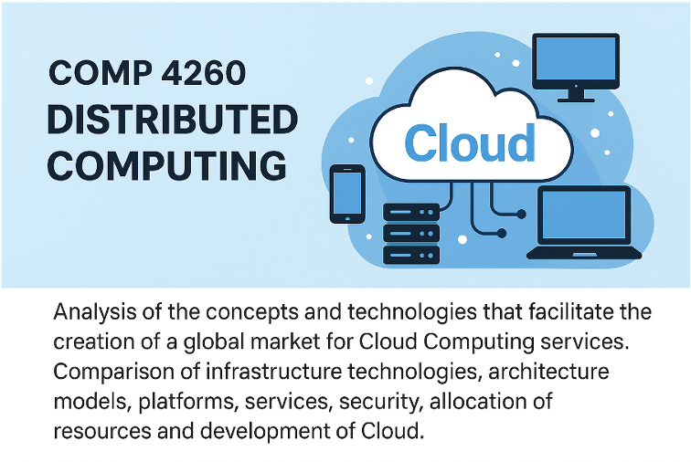

# Proyecto Azure for Students - COMP 4260 DISTRIBUTED COMPUTING

## Curso: COMP 4260 DISTRIBUTED COMPUTING
**Análisis de los conceptos y tecnologías que facilitan la creación de un mercado global para servicios de Cloud Computing.**  
Comparación de tecnologías de infraestructura, modelos de arquitectura, plataformas, servicios, seguridad, asignación de recursos y desarrollo de Cloud Privada.

## Descripción del Proyecto
Este proyecto guía a los estudiantes en la implementación de una aplicación web utilizando los servicios gratuitos de Azure for Students. Se desarrolla una aplicación en Flask que se despliega en Azure App Service y se conecta a una base de datos Azure SQL Database. A través del proyecto, los estudiantes aplicarán los conceptos aprendidos en el curso para crear, configurar y desplegar una aplicación basada en la nube.

## Objetivos del Proyecto
- Crear y configurar una base de datos en Azure SQL Database.
- Implementar variables de entorno para la conexión entre la aplicación y la base de datos.
- Desplegar una aplicación web en Azure App Service.
- Documentar cada paso del proceso, incluyendo los retos y soluciones aplicadas.
- Realizar una presentación del proyecto siguiendo la estructura proporcionada.

## Tabla de Documentos del Proyecto

| Nombre del Documento | Descripción |
|----------------------|-------------|
| [Guia_Crear_Azure_SQL_Database.md](./Guia_Crear_Azure_SQL_Database.md) | Guía paso a paso para crear una base de datos SQL en Azure, configurando el servidor, firewall y obteniendo las credenciales. |
| [Guia_Configurar_Variables_AppService.md](./Guia_Configurar_Variables_AppService.md) | Guía para configurar las variables de entorno en Azure App Service, asegurando la conexión entre la aplicación y la base de datos. |
| [README_AZURE_FOR_STUDENTS.md](./README_AZURE_FOR_STUDENTS.md) | Documento README que describe el proyecto, los servicios utilizados, configuración, costos estimados y lecciones aprendidas. |
| [Tutorial_Completo_Proyecto_Azure.md](./Tutorial_Completo_Proyecto_Azure.md) | Tutorial completo en español que guía el proceso de creación, configuración y despliegue de la aplicación en Azure. |
| [Tutorial_Complete_Project_Azure_EN.md](./Tutorial_Complete_Project_Azure_EN.md) | Versión en inglés del tutorial completo para la creación y despliegue de la aplicación en Azure. |
| [Plantilla_Presentacion_Proyecto.md](./Plantilla_Presentacion_Proyecto.md) | Plantilla estructurada para la presentación del proyecto, incluyendo título, objetivos, arquitectura, retos, soluciones y lecciones aprendidas. |

## Créditos
Curso: COMP 4260 DISTRIBUTED COMPUTING  
Profesor: Javier A. Dastas  
Universidad Interamericana de Puerto Rico – Recinto de Arecibo
